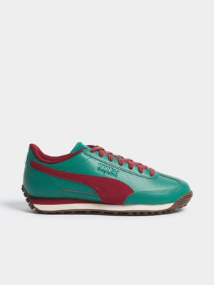

# 👠 Shoes VTON
As part of the research, a Shoes Virtual Try-On pipeline has been developed, utilizing frames from 3D scenes generated based on reference shoe images.

I always welcome everyone to contribute!

**Example**

<table>

<tr>
<td> <b> Person Image </b> </td>
<td> <b> Reference Shoe </b> </td>
<td> <b> Result </b> </td>
</tr> 

<tr>
<td> </td>
<td> </td>
<td> </td>
</tr> 

</table>

# Usage

Create and activate a virtual env:
```bash
python3.10 -m venv venv
. ./venv/bin/activate
```
Install requirements:
```bash
pip install -r requirements.txt
```
Run the pipeline:
```bash
python src/main.py
```

You can edit **source person** and **reference shoe** images paths in `src/main.py`

# Pipeline Description
- Conversion of the shoe image into 3D using TRELLIS.
- Generation of a scene with a camera adjusted to the desired angle in the 3D version of the shoe and conversion to 2D.
- Segmentation of the shoe area on the original image with the person.
- Outpainting of the masked area with the original shoe using Lama.
- Placement of the new shoe into the original image, replacing the mask.

# Experiments

**Obtaining a 3D Model**

<table>

<tr>
<td> <b> Reference Shoe </b> </td>
<td> <b> Rotated Left Shoe </b> </td>
<td> <b> Rotated Right Shoe </b> </td>
</tr> 

<tr>
<td> </td>
<td> </td>
<td> </td>
</tr> 

</table>


**Obtaining Shoe Masks**

<table>

<tr>
<td> <b> Person Image </b> </td>
<td> <b> Left mask </b> </td>
<td> <b> Right mask </b> </td>
<td> <b> Union mask </b> </td>
</tr> 

<tr>
<td> </td>
<td> </td>
<td> </td>
<td> </td>
</tr> 

</table>


**Removing Old and Placing New Shoes**

<table>

<tr>
<td> <b> Person Image </b> </td>
<td> <b> Outpainted Shoes </b> </td>
<td> <b> Inpainted Left </b> </td>
<td> <b> Inpainted Right </b> </td>
</tr> 

<tr>
<td> </td>
<td> </td>
<td> </td>
<td> </td>
</tr> 

</table>

# References
- [Segmentator for obtaining a mask](htps://huggingface.co/matmdjaga/segformer_b2_clothes)
- [TRELLIS (2D-to-3D Generation)](htps://huggingface.co/spaces/JeffreyXiang/TRELLIS)
- [Lama (Object outpainting)](htps://github.com/enesmsahin/simple-lama-inpainting)

# To Do
- Improve the method for determining the shoe angle
- Use a trained diffusion model for shoe placement
